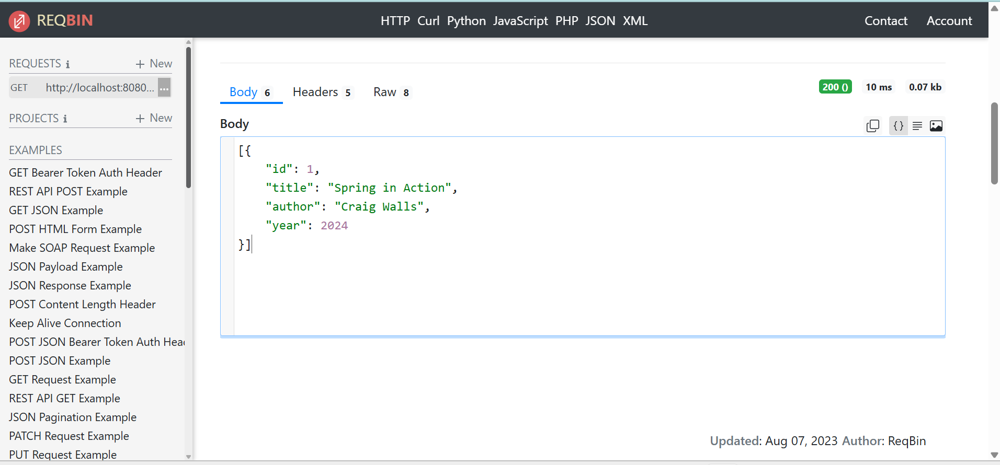

# In-Memory Library API

## 1. Project Title & Goal
A Spring Boot REST API that manages a library’s book inventory using strictly in-memory storage without any database.

---

## 2. Setup Instructions

Follow these steps to run the project locally:

1. Clone the repository from GitHub
2. Open the project in Eclipse IDE
3. Navigate to:
   src/main/java/com/zimetrics/library_api/LibraryApiApplication.java
4. Right click → Run As → Java Application
5. The server will start on:
   http://localhost:8080

---

## 3. The Logic (How I thought)

### Why did I choose this approach?

I chose Spring Boot because it is lightweight, easy to configure, and widely used for building REST APIs.  
Since the problem statement required strictly in-memory storage, I avoided using any database and instead used a HashMap to store book objects during runtime.

This approach keeps the project simple, fast, and fully local, while still demonstrating proper REST API design.

### What was the hardest bug I faced, and how did I fix it?

Initially, I used Lombok annotations in the Book class to generate getters and setters.  
However, Eclipse did not recognize Lombok-generated methods, which caused errors like:

getId() is undefined for the type Book

To fix this quickly and avoid IDE plugin issues, I removed Lombok and manually implemented getters and setters in the Book class.  
After restarting the application, the issue was resolved and the API worked correctly.

---

## 4. Output Screenshot Proof

Below is the screenshot of the GET request showing the list of books added in memory:

---

## 5. Future Improvements

If I had two more days to improve this project, I would:

- Add validation to prevent duplicate book IDs
- Return proper HTTP status codes using ResponseEntity
- Add Swagger UI for interactive API documentation
- Implement update (PUT) endpoint for modifying book details
- Add basic exception handling for invalid requests
